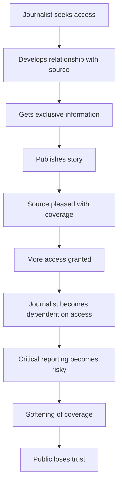

**WASHINGTON** ΓÇö The White House Correspondents' Dinner is supposed to be a celebration of the First Amendment ΓÇö a night where the press corps that holds power to account shares a room with the people they cover. But in Trump's second term, that room has become something else entirely: a theater of corruption where access journalism meets authoritarianism.

On April 25, 2026, as champagne flutes clinked and politicians mingled with the reporters they routinely vilify, the sound of gunfire shattered the evening. The third assassination attempt against President Trump in less than two years had been foiled.

The story that followed revealed something far more dangerous than the attempt itself: a Justice Department transformed into a weapon against the press, headed by a man who owes his career to slavish loyalty to Trump, and a media ecosystem so compromised by access that it has lost the trust of the American people.

## Todd Blanch: From Personal Lawyer to Top Cop

The man now running the Justice Department is Todd Blanch. His qualification? He was Donald Trump's personal lawyer.

That's not hyperbole. Blanch climbed to the position of Acting Attorney General primarily out of loyalty to Trump, not legal expertise or institutional knowledge. He defended Trump in court, represented his interests privately, and then was handed the keys to the federal law enforcement apparatus that is supposed to be independent of the president.

The conflict of interest is so glaring it's almost cartoonish:

| Before AG | After AG |
| --- | --- |
| Personal lawyer for Donald Trump | Runs the entire federal justice system |
| Defended Trump in court cases | Can investigate Trump's enemies |
| Paid by Trump as a client | Controls investigations into Trump |
| Loyalty to one man | Supposed to serve 330 million Americans |

This is the textbook definition of corruption: the capture of state institutions for personal and political ends.

## The Attorney General's War on Journalism

At his first press briefing as Acting Attorney General, held immediately after the shooting at the White House Correspondents' Dinner, Blanch did something no previous AG would have dared: he blamed the press for political violence.

> "And many people in this room, they're just as guilty as a lot of people on X. When you have when you have reporters being overly critical and and calling the president horrible names for no reason, the political violence and rhetoric has has got to stop."

Let that sink in. The nation's top law enforcement official, standing in the Justice Department, told reporters that their reporting is causing violence.

This is not just wrong ΓÇö it's dangerous. It sends a message to Trump's supporters that journalists are legitimate targets. It suggests that asking tough questions or publishing critical stories is equivalent to inciting violence.

And it's rich coming from an administration that has done this:

- Threatened journalists with jail for doing their jobs
- Restricted reporters' access to the White House press pool
- Restricted access to the Pentagon
- Dismissed accurate reporting as "fake news"
- Filed lawsuits against multiple news outlets
- Called the media "enemies of the people"

The hypocrisy is staggering. Trump has spent his political career delegitimizing the press, then his AG claims the press is causing political division.

## Access Journalism: The Dinner That Exposes Everything

The White House Correspondents' Dinner was a trainwreck waiting to happen, and the assassination attempt only exposed what critics have been saying for years: this event is antithetical to good journalism.

Here's the scene: the Washington press corps, dressed in evening gowns and tuxedos, mingling with an administration that has called them "enemies of the people," that has sued them, that has restricted their access, that has threatened them with jail.

And they're laughing together. Drinking wine together. Taking selfies together.

This is access journalism in its purest form: the trade of favorable coverage for proximity to power. The dirty secret of Washington media is that much of their journalism depends on access to the people they're supposed to hold accountable. Being next to the president at the dinner means he might give you an exclusive interview later. Being friendly with the press secretary means you might get a tip about an upcoming announcement.

But what happens when the cost of that access is your credibility?

> "This is sort of the dirty secret of the Washington DC media. As much as they criticize the president and vice versa, at the end of the day, a lot of their journalism is based on access to the people in power. And part of this access journalism is that attending the White House correspondents dinner and being next to the president means that they might feel more favorably towards you and give you more access to what's happening inside the administration."

When the shooting happened, journalists sprinted from the ballroom in their heels and evening gowns to the press briefing room to report the story. They did their jobs well in that moment. But the optics were terrible: the same reporters who had been clinking glasses with the president moments earlier were now supposed to be covering an assassination attempt against him objectively.

The American people saw that and thought: *They're all in this together. They're all part of the same club.*

<!-- IMAGE alt="Todd Blanch at DOJ press conference podium, speaking to reporters about the White House Correspondents' Dinner shooting" asset="image-90fd3be86f339b5e69c4e8bf50c29d8ab2bd458e-2000x1344-webp" -->

## The Perfect Storm of Distrust

The collapse of trust in American media didn't happen overnight. It's the result of a perfect storm:

1. **Trump's relentless attacks on the press** ΓÇö calling them "enemies of the people," dismissing them as "fake news," threatening them with jail
1. **Access journalism** ΓÇö the coziness between reporters and the people they're supposed to hold accountable
1. **The rise of social media** ΓÇö which gives conspiracy theories audiences they've never had before
1. **The collapse of traditional media** ΓÇö declining revenues, fewer reporters, less depth
1. **Political polarization** ΓÇö two parties living in separate realities, with separate facts

The result? A landscape where nobody trusts anybody.

> "We have essentially two political tribes in the United States. We have to collectively in essence burn down the Republican party. Democrats have no in between. There is no happy medium because there is no happy anything. They often disagree about facts. Republicans are doing something that is very dangerous to our society and we have to acknowledge that. Democrats, remember, can't even identify a woman. Nobody is really trusted."

And that is exactly why the general public has been increasingly tuning out mainstream media and turning towards conspiracy theorists.

## The Conspiracy Theory Industrial Complex

The assassination attempt spawned an explosion of conspiracy theories, racking up **80 million views on X in just 2 days**. The dominant narrative: the whole thing was staged.

Sound familiar? It should. The far-right QAnon movement has been peddling similar theories for years. But here's what's new: these conspiracy theories are also coming from the political left.

Researchers have dubbed this "BlueAnon" ΓÇö a deliberate echo of QAnon, but for liberals. The theories are the same: Trump staged the assassination attempt for sympathy, for political advantage, for attention.

The motivations are different, but the process is identical: follow the money.

> "Unfortunately, there is a segment of people online who get money off of engagement. Every time Trump has like a problem or needs to get reelected or his poll numbers slump, somebody supposedly tries to assassinate him. And so it is profitable for them to sew discord and misinformation because it makes them more money."

Social media platforms are built on engagement. Controversy drives engagement. Conspiracy theories are the most engaging content of all.

The result is an information ecosystem where truth is optional, but outrage is mandatory. Both QAnon and BlueAnon are doing the same thing: causing chaos and confusion, eroding trust in institutions, and profiting from the dysfunction.

## What Real Accountability Would Look Like

A Department of Justice that served the public interest rather than the president's personal interests would look very different:

1. **An independent Attorney General** ΓÇö not a former personal lawyer with a clear conflict of interest
1. **Respect for the First Amendment** ΓÇö protecting journalists' right to report, not threatening them with jail
1. **Equal enforcement of the law** ΓÇö investigating crimes regardless of political affiliation
1. **Transparency** ΓÇö releasing information about investigations without political calculation
1. **Institutional independence** ΓÇö resisting pressure from the White House to target enemies

Instead, we have the opposite:

- Todd Blanch using his position to attack the press
- Trump threatening journalists with imprisonment
- The DOJ potentially targeting Trump's political opponents
- Justice Department resources deployed to protect the president's narrative
- A Justice Department that sees criticism of the president as subversive

## The Bigger Picture: Authoritarianism in American Politics

What we're witnessing is not just corruption ΓÇö it's the creeping authoritarianization of American democracy.

Authoritarian leaders follow a predictable playbook:

1. **Attack the press** ΓÇö delegitimize independent journalism so people don't believe negative stories about you
1. **Capture law enforcement** ΓÇö place loyalists in charge of investigating crimes, so they protect you and target your enemies
1. **Erode trust in institutions** ΓÇö convince people that nothing is true, so they'll believe only you
1. **Concentrate power** ΓÇö remove checks and balances, consolidate control over the levers of state power
1. **Create alternative reality** ΓÇö build a media ecosystem that tells your version of events, regardless of facts

Trump has checked every box.

The White House Correspondents' Dinner fiasco is just the most visible symptom. The rot goes much deeper.

## What Happens Next?

The assassination attempt against Trump was foiled. But the attack on American democracy continues.

Todd Blanch remains in charge of the Justice Department. Trump continues to threaten journalists. The White House Correspondents' Association is already planning next year's dinner, despite renewed calls to end the schmoozing between journalists and the administration.

Conspiracy theories continue to circulate on social media, racking up millions of views. Trust in media continues to decline.

Unless something changes ΓÇö unless Congress provides oversight, unless the courts push back, unless the American people demand better ΓÇö the corruption will deepen.

Because here's the thing about corruption: it doesn't get better on its own. It gets worse.

<!-- IMAGE alt="CNN journalists Pamela Brown and Wolf Blitzer in formal attire at the White House Correspondents' Dinner, highlighting the coziness between press and politicians" asset="image-6d54e15264eec2b01f2ea7f58d7c19d4f5ef93a0-1920x1080-webp" -->

## The Historical Context

This is not the first time America has faced a crisis of trust in media. Conspiracy theories have been part of the American story from the beginning:

- **Elections of 1800** ΓÇö wild accusations about Thomas Jefferson
- **Civil War** ΓÇö competing narratives about why the war was fought
- **Pearl Harbor** ΓÇö theories that FDR knew about the attack in advance
- **JFK assassination** ΓÇö decades of conspiracy theories
- **Vietnam War** ΓÇö government lies exposed by journalists

But there's a difference between then and now: the scale and speed of information.

> "They don't merely exist on the far edges. That's the digital communications moment in which we live. The rise of social media, which gains modern-day conspiracy theories audiences of a size they have never had before, lends them a prominence they seldom deserve, while eroding the trust the mainstream media used to have, and creating a landslide of doubt that has helped bury their credibility."

In 1800, a conspiracy theory spread by word of mouth, town to town, over weeks or months. Today, a conspiracy theory can reach 80 million people in 48 hours.

The technology has changed. The human psychology hasn't.

## The Access Journalism Death Spiral

The White House Correspondents' Dinner is a symptom of a larger disease: access journalism has become the default mode of reporting in Washington.

Here's how it works:

The problem is structural. Journalists need access to do their jobs. Access requires relationships. Relationships require goodwill. Goodwill often means softening coverage.

In a healthy media ecosystem, there are enough outlets with different approaches that this doesn't matter. One outlet goes soft on a source, another goes hard. The truth emerges somewhere in the middle.

But in an ecosystem dominated by a few large corporations, where access is increasingly concentrated in the hands of a few elite reporters, the system breaks down.

## The Money Behind the Madness

Here's the uncomfortable truth: the media ecosystem that produced Todd Blanch, the White House Correspondents' Dinner, and the conspiracy theory industrial complex is not an accident. It's a business model.

- Cable news makes money from conflict and outrage
- Social media makes money from engagement and clicks
- Political newsletters make money from stoking fear and anger
- Conspiracy theorists make money directly from their audience through subscriptions, donations, and merchandise

The incentives are aligned against truth.

> "Going on social media these days is just like an immediate cortisol spike and we increasingly are just going into our little corners just chatting with anonymous people. They might not even be American."

The system is working exactly as designed. The problem is what it's designed to do: make money, not inform citizens.

## What Needs to Change

If American democracy is going to survive this crisis, several things need to happen:

### 1. Congressional Oversight

Congress needs to exercise its oversight authority over the Justice Department. Todd Blanch should be called to testify. The use of DOJ resources to attack the press should be investigated. The appointment process for the next Attorney General should be rigorous, with a focus on independence, not loyalty.

### 2. Judicial Protection

The courts need to defend the First Amendment vigorously. When Trump threatens journalists with jail, when the DOJ uses its power to intimidate the press, the courts need to push back ΓÇö hard.

### 3. Media Self-Reform

Journalists need to end the access journalism trap. The White House Correspondents' Dinner should be cancelled, or at minimum reimagined. Reporters should prioritize independence over access. News organizations should support journalists who lose access for doing their jobs well.

### 4. Platform Accountability

Social media companies need to take responsibility for the conspiracy theories they amplify. Algorithmic changes to prioritize authoritative sources over engagement-bait would be a start. Transparent labeling of state media and conspiracy theory content would help.

### 5. Public Literacy

Americans need media literacy education. Understanding how to evaluate sources, recognize disinformation, and think critically about what they read is a survival skill in the 21st century.

## The Stakes

This is not just about one dinner, one Attorney General, or one presidency. This is about whether American democracy can survive in the information age.

If the Justice Department becomes a weapon for the president against his critics, we no longer have rule of law ΓÇö we have rule by law.

If the press cannot hold power to account without fear of retribution, we no longer have a free press ΓÇö we have state media.

If citizens cannot agree on basic facts, we no longer have a democracy ΓÇö we have competing realities.

The corruption we're seeing ΓÇö Todd Blanch's appointment, the attacks on journalism, the access journalism rot, the conspiracy theory flood ΓÇö is not just a scandal. It's a symptom of a deeper rot.

And unless we address it, it will consume the entire system.